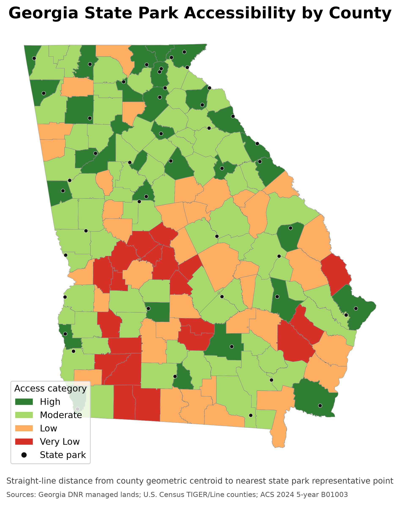
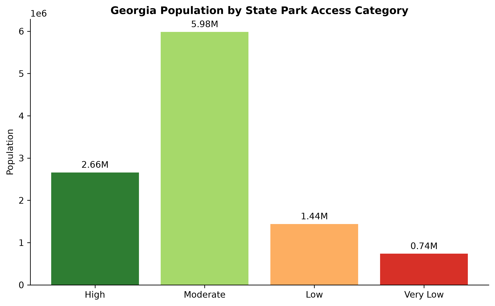
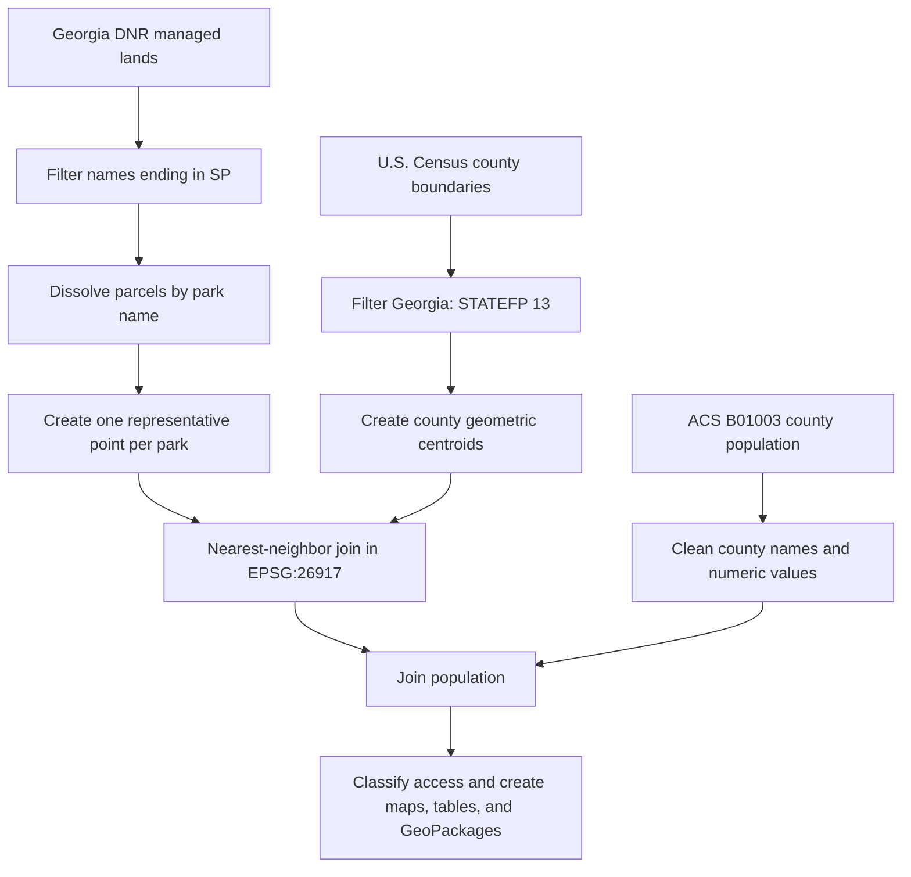
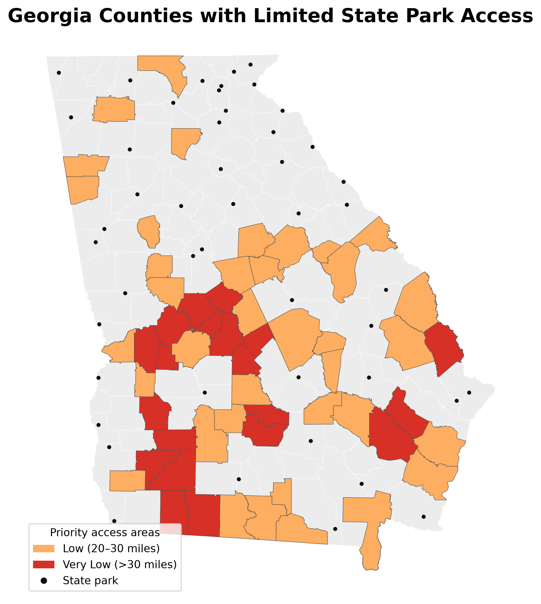

# Georgia State Park Accessibility

This project evaluates geographic access to Georgia State Parks by measuring the straight-line distance from each county's geometric centroid to the representative point of its nearest state park. County population estimates are added to show how many residents live in each access category.



## Key findings

The validated analysis covers all **159 Georgia counties** and **47 uniquely named state parks**.

| Access category | Distance to nearest park | Counties | Population | Share |
|---|---:|---:|---:|---:|
| High | 10 miles or less | 31 | 2,660,103 | 24.6% |
| Moderate | More than 10 to 20 miles | 71 | 5,984,947 | 55.3% |
| Low | More than 20 to 30 miles | 37 | 1,440,839 | 13.3% |
| Very Low | More than 30 miles | 20 | 736,701 | 6.8% |

Together, **2,177,540 residents (20.1%)** live in counties classified as Low or Very Low access under this screening method. Population totals and percentages are available in [`data/processed/accessibility_summary.csv`](data/processed/accessibility_summary.csv). The ten counties with the greatest calculated distances are in [`data/processed/top10_underserved_counties.csv`](data/processed/top10_underserved_counties.csv).



## Research question

How does straight-line proximity to Georgia State Parks vary among Georgia counties, and how many residents live in counties with lower proximity-based access?

## Methodology



1. U.S. county boundaries were filtered to Georgia using state FIPS code `13`.
2. The Georgia DNR managed-lands layer was filtered to features whose names end in `SP`. Parcels were dissolved by name, producing 47 uniquely named state parks.
3. Park polygons were converted to representative centroid points after projection.
4. County geometric centroids and park representative points were calculated in **NAD83 / UTM zone 17N (EPSG:26917)**.
5. GeoPandas `sjoin_nearest` assigned the nearest park and straight-line distance to each county centroid.
6. Distances were converted from metres to miles and joined to ACS 2024 five-year table B01003 population estimates.
7. Counties were classified as High (≤10 miles), Moderate (>10–20), Low (>20–30), or Very Low (>30).

## Data sources

- **County boundaries:** U.S. Census Bureau, 2025 TIGER/Line county shapefile.
- **Population:** U.S. Census Bureau, 2024 ACS five-year table B01003 (Total Population).
- **State parks:** Georgia Department of Natural Resources managed-lands dataset (`dnr20a`).

Raw source files are intentionally excluded from Git because several downloads are very large. Place them in the paths shown below before reproducing the analysis.

```text
data/raw/
├── census/population.csv
├── counties/tl_2025_us_county/tl_2025_us_county.shp
└── state_parks/State_Parks/dnr20a.shp
```

Keep each shapefile's companion `.dbf`, `.prj`, `.shx`, and `.cpg` files in the same directory.

The separately downloaded road dataset is named `tl_2025_13_prisecroads.shp` in the current project. It is not used in this straight-line analysis.

## Setup and reproduction

Install [Miniconda](https://docs.conda.io/projects/miniconda/en/latest/) or Anaconda, open a terminal in this project folder, and run:

```bash
conda env create -f environment.yml
conda activate ga-state-park-access
python -m ipykernel install --user --name ga-state-park-access --display-name "Python (GA State Park Access)"
python scripts/reproduce_analysis.py
```

In Jupyter, select the **Python (GA State Park Access)** kernel. On the original computer, the previously working environment is:

```text
C:\Users\cason\miniconda3\envs\myenvironment\python.exe
```

The base Miniconda environment does not currently include GeoPandas.

## Outputs

- `data/processed/state_park_accessibility.gpkg` — county polygons with population, nearest park, distance, and access category.
- `data/processed/park_points.gpkg` — 47 representative state-park points.
- `data/processed/accessibility_summary.csv` — counties, population, and population share by category.
- `data/processed/top10_underserved_counties.csv` — counties with the greatest straight-line distances.
- `maps/accessibility_map.png` — statewide accessibility map.
- `maps/priority_areas_map.png` — Low and Very Low access counties.
- `maps/population_by_access_category.png` — population summary chart.
- `notebooks/state_park_accessibility_analysis_backup.ipynb` — preserved exploratory notebook.
- `scripts/reproduce_analysis.py` — clean reproducible workflow and validation checks.

## Map interpretation



The maps describe proximity from a single representative point per county to a single representative point per park. They should be interpreted as a screening-level indicator of geographic access—not as household-level access, driving distance, or travel time.

## Limitations

- Distances are Euclidean straight-line distances, not road-network distances or drive times.
- County geometric centroids do not represent the spatial distribution of residents, particularly in large or irregular counties.
- Park centroids may fall away from a public entrance and do not represent the nearest accessible entrance.
- County-level population totals are assigned to one centroid, so the analysis does not estimate the number of individual residents within a particular travel distance.
- The DNR layer was filtered using the terminal `SP` naming designation; this rule should be revalidated if the source schema changes.
- Park amenities, capacity, admission restrictions, transit availability, and local or federal recreation sites are outside the scope.

## Future work

The next analytical phase should use a routable network rather than the TIGER/Line precise-roads layer alone. Recommended approaches are:

1. Use **OSMnx/OpenStreetMap** or **ArcGIS Network Analyst** to route from population-weighted census tract or block-group centroids to verified park entrances.
2. Calculate 15-, 30-, 45-, and 60-minute drive-time service areas.
3. Use smaller census geographies to estimate population inside and outside each service area.
4. Compare state-park access with income, vehicle availability, age, and urban/rural status.
5. Publish the resulting layers as an interactive ArcGIS Online or web map with county pop-ups and category filters.

## Repository structure

```text
.
├── data/
│   ├── processed/
│   └── raw/                 # ignored; download separately
├── maps/
├── notebooks/
├── scripts/
├── .gitignore
├── environment.yml
└── README.md
```
