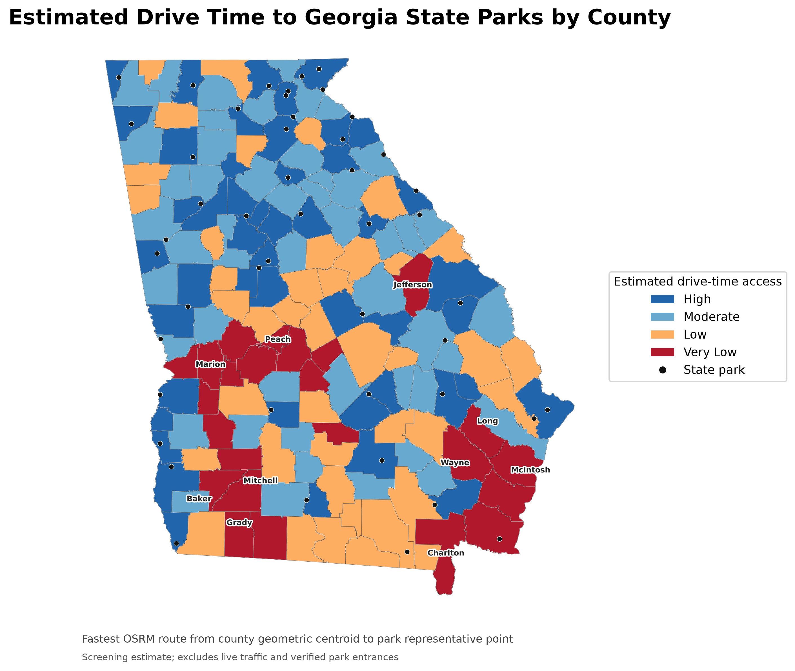
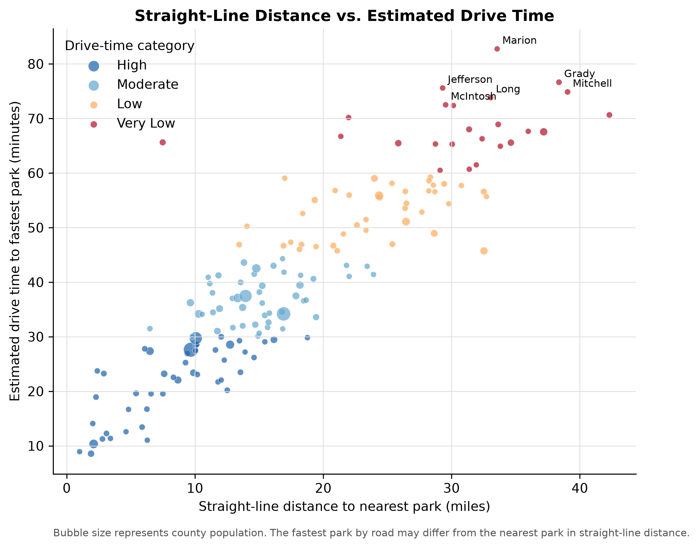
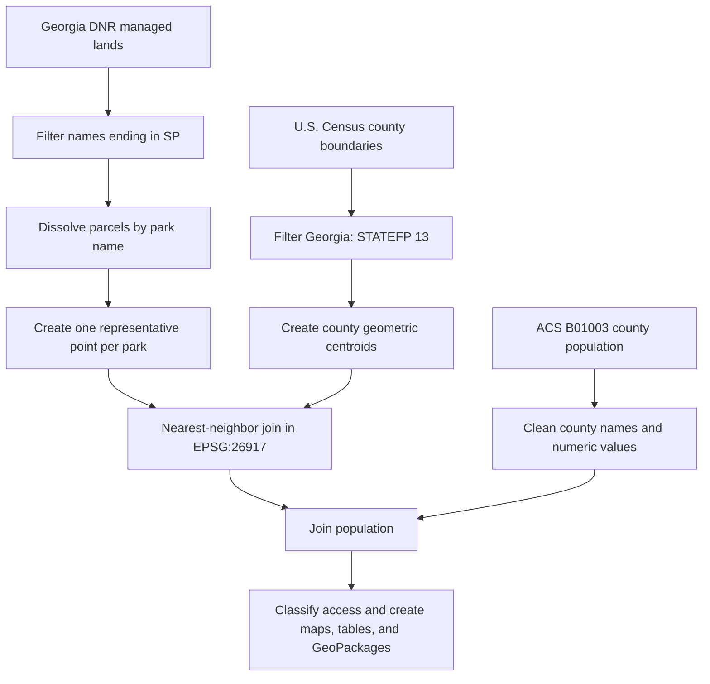

# Georgia State and Local Park Accessibility by County

This project evaluates geographic access to Georgia State Parks by measuring the straight-line distance from each county's geometric centroid to the representative point of its nearest state park. County population estimates are added to show how many residents live in each access category.


## Interactive map

[Open the interactive Georgia State and Local Park Accessibility map](https://casondow.github.io/georgia-state-park-accessibility/)

Use the layer control to switch between straight-line accessibility and estimated drive-time accessibility. Hover over a county for its population, nearest park, distance or travel-time estimate, and category. Zoom in, then turn on **State park labels** to display all 47 park names without overwhelming the statewide view.

For counties classified as Low or Very Low drive-time access, the county tooltip also lists up to three nearby named OpenStreetMap recreation options. Turn on **Suggested nearby recreation options** to display them as purple markers. These features are informational suggestions only; confirm ownership, public access, entrances, hours, and amenities before visiting.

The static maps label the state parks associated with the ten highest-burden counties. This selective labeling avoids obscuring county symbology while identifying the destinations most relevant to the findings.

Click the **⌖ Locate me** button beneath the zoom controls to estimate access from the visitor's current location. The map compares the fastest estimated drive to a Georgia state park with the fastest estimated drive to a nearby named OSM recreation option, displays both route distances and travel times, and draws the routes in blue and purple. Browser location permission is required. Coordinates are not stored by this site; they are sent to the public OSRM service solely to calculate the requested routes.

Each result also includes an **Open driving directions** link that opens the selected destination in Google Maps. Visitors should verify the destination entrance, operating status, and route before traveling.

Select the **? Help** control for a concise explanation of the map controls, route colors, layer menu, and routing limitations. On phone-sized screens, the results and help panels expand across the available width while the large legend is hidden to preserve map space; the same categories remain available through the layer menu and county popups.

Select the **⌕ Search** control to analyze any Georgia address, city, or ZIP code without sharing the visitor's current device location. Search text is sent to OpenStreetMap's public Nominatim geocoding service; the resulting coordinates are then sent to OSRM for the requested route comparison. The site does not store the query or coordinates.

State-park markers and state-park routing results link to the corresponding **official Georgia State Parks page** when a dedicated visitor page was matched. Those pages are the authoritative source for current alerts, hours, facilities, reservations, trail maps, and events. Three mapped legacy or planning-area names—Balls Ferry, Bush Head Shoals, and Mossy Creek—did not match dedicated pages in the current official directory, so the map directs visitors to the statewide directory and advises them to verify public access.

Select the **▦ County explorer** control to choose any of Georgia's 159 counties. The map zooms to that county and reports its ACS population, straight-line access category, nearest state park and distance, estimated drive-time category and route distance, official park link, and curated nearby recreation suggestions where available.

Location-routing results and County Explorer results include a **Share result** action. On devices supporting the Web Share API, it opens the native sharing menu; otherwise, it copies a concise result summary and the live-map URL to the clipboard.

Nearby local-recreation results now include **Verify in OpenStreetMap** links. The links appear in purple-marker popups, location-routing results, and County Explorer suggestions, allowing visitors to inspect the mapped feature and surrounding roads before deciding whether it is suitable or publicly accessible.

Select the **i About** control to review the project purpose, straight-line and drive-time methods, classification thresholds, headline findings, authoritative sources, privacy behavior, and major limitations directly inside the interactive map.

## Key findings

The validated analysis covers all **159 Georgia counties** and **47 uniquely named state parks**.

| Access category | Distance to nearest park | Counties | Population | Share |
|---|---:|---:|---:|---:|
| High | 10 miles or less | 31 | 2,660,103 | 24.6% |
| Moderate | More than 10 to 20 miles | 71 | 5,984,947 | 55.3% |
| Low | More than 20 to 30 miles | 37 | 1,440,839 | 13.3% |
| Very Low | More than 30 miles | 20 | 736,701 | 6.8% |

Together, **2,177,540 residents (20.1%)** live in counties classified as Low or Very Low access under this screening method. Population totals and percentages are available in [`data/processed/accessibility_summary.csv`](data/processed/accessibility_summary.csv). The ten counties with the greatest calculated distances are in [`data/processed/top10_underserved_counties.csv`](data/processed/top10_underserved_counties.csv).


### Estimated drive-time screening

An additional OSRM analysis estimates the fastest driving route from each county geometric centroid to each park representative point:

| Drive-time category | Estimated time | Counties | Population | Share |
|---|---:|---:|---:|---:|
| High | 30 minutes or less | 46 | 3,805,384 | 35.2% |
| Moderate | More than 30 to 45 minutes | 49 | 4,553,046 | 42.1% |
| Low | More than 45 to 60 minutes | 40 | 1,768,964 | 16.3% |
| Very Low | More than 60 minutes | 24 | 695,196 | 6.4% |

These are screening estimates, not observed travel times. They do not use verified park entrances, household origins, live traffic, or turn-by-turn validation.



The fastest park by road is not always the park with the shortest straight-line distance. The comparison below shows how road-network structure changes the accessibility picture; bubble size represents county population.



## Research question

How does straight-line proximity to Georgia State Parks vary among Georgia counties, and how many residents live in counties with lower proximity-based access?

## Methodology



1. U.S. county boundaries were filtered to Georgia using state FIPS code `13`.
2. The Georgia DNR managed-lands layer was filtered to features whose names end in `SP`. Parcels were dissolved by name, producing 47 uniquely named state parks.
3. Park polygons were converted to representative centroid points after projection.
4. County geometric centroids and park representative points were calculated in **NAD83 / UTM zone 17N (EPSG:26917)**.
5. GeoPandas `sjoin_nearest` assigned the nearest park and straight-line distance to each county centroid.
6. Distances were converted from metres to miles and joined to ACS 2024 five-year table B01003 population estimates.
7. Counties were classified as High (≤10 miles), Moderate (>10–20), Low (>20–30), or Very Low (>30).

## Data sources

- **County boundaries:** U.S. Census Bureau, 2025 TIGER/Line county shapefile.
- **Population:** U.S. Census Bureau, 2024 ACS five-year table B01003 (Total Population).
- **State parks:** Georgia Department of Natural Resources managed-lands dataset (`dnr20a`).

Raw source files are intentionally excluded from Git because several downloads are very large. Place them in the paths shown below before reproducing the analysis.

```text
data/raw/
├── census/population.csv
├── counties/tl_2025_us_county/tl_2025_us_county.shp
└── state_parks/State_Parks/dnr20a.shp
```

Keep each shapefile's companion `.dbf`, `.prj`, `.shx`, and `.cpg` files in the same directory.

The separately downloaded road dataset is named `tl_2025_13_prisecroads.shp` in the current project. It is not used in this straight-line analysis.

## Setup and reproduction

Install [Miniconda](https://docs.conda.io/projects/miniconda/en/latest/) or Anaconda, open a terminal in this project folder, and run:

```bash
conda env create -f environment.yml
conda activate ga-state-park-access
python -m ipykernel install --user --name ga-state-park-access --display-name "Python (GA State Park Access)"
python scripts/reproduce_analysis.py
python scripts/drive_time_analysis.py
python scripts/build_local_park_suggestions.py
python scripts/build_interactive_map.py
python scripts/build_drive_time_maps.py
```

In Jupyter, select the **Python (GA State Park Access)** kernel. On the original computer, the previously working environment is:

```text
C:\Users\cason\miniconda3\envs\myenvironment\python.exe
```

The base Miniconda environment does not currently include GeoPandas.

## Outputs

- `data/processed/state_park_accessibility.gpkg` — county polygons with population, nearest park, distance, and access category.
- `data/processed/park_points.gpkg` — 47 representative state-park points.
- `data/processed/accessibility_summary.csv` — counties, population, and population share by category.
- `data/processed/top10_underserved_counties.csv` — counties with the greatest straight-line distances.
- `data/processed/drive_time_accessibility.gpkg` — county polygons with estimated OSRM travel time and route distance.
- `data/processed/drive_time_summary.csv` — county and population totals by estimated drive-time category.
- `data/processed/top10_drive_time_counties.csv` — longest estimated county-centroid drive times.
- `data/processed/local_park_suggestions.csv` — up to three named OSM recreation suggestions for Low/Very Low counties.
- `data/processed/local_park_suggestions.gpkg` — mapped suggested recreation points.
- `data/processed/local_recreation_options.gpkg` — named OSM park and recreation-ground candidates used by Locate me.
- `maps/accessibility_map.png` — statewide accessibility map.
- `maps/priority_areas_map.png` — Low and Very Low access counties.
- `maps/population_by_access_category.png` — population summary chart.
- `maps/interactive_accessibility_map.html` — standalone interactive map.
- `maps/drive_time_accessibility_map.png` — estimated drive-time choropleth.
- `maps/distance_vs_drive_time.png` — straight-line distance versus estimated travel time.
- `docs/index.html` — GitHub Pages copy of the interactive map.
- `notebooks/state_park_accessibility_analysis_backup.ipynb` — preserved exploratory notebook.
- `scripts/reproduce_analysis.py` — clean reproducible workflow and validation checks.

## Map interpretation


The maps describe proximity from a single representative point per county to a single representative point per park. They should be interpreted as a screening-level indicator of geographic access—not as household-level access, driving distance, or travel time.

## Limitations

- Distances are Euclidean straight-line distances, not road-network distances or drive times.
- County geometric centroids do not represent the spatial distribution of residents, particularly in large or irregular counties.
- Park centroids may fall away from a public entrance and do not represent the nearest accessible entrance.
- County-level population totals are assigned to one centroid, so the analysis does not estimate the number of individual residents within a particular travel distance.
- The DNR layer was filtered using the terminal `SP` naming designation; this rule should be revalidated if the source schema changes.
- Park amenities, capacity, admission restrictions, transit availability, and local or federal recreation sites are outside the scope.
- Estimated drive times use OSRM/OpenStreetMap routing from county centroids to park centroids. They do not represent live traffic or verified public entrances.
- The public OSRM demo endpoint is used for a small reproducible screening analysis and is not a production service-level dependency.
- Nearby recreation suggestions are extracted from named OpenStreetMap `park` and `recreation_ground` features. Their ownership, accessibility, completeness, and current operating status are not independently verified.
- Locate me evaluates the 25 geographically closest state-park candidates and 25 geographically closest named recreation candidates, then compares their OSRM travel times. It is a practical screening tool, not a guarantee that every possible destination was exhaustively routed.
- Address search uses OpenStreetMap Nominatim results restricted to Georgia. Geocoding may select an approximate place or a different matching address, so visitors should verify the displayed destination and route.
- Official-page matching reflects the Georgia State Parks directory reviewed in July 2026. Park names, operating arrangements, URLs, alerts, and amenities can change; the linked official page should always be checked before travel.

## Future work

The next analytical phase should use a routable network rather than the TIGER/Line precise-roads layer alone. Recommended approaches are:

1. Use **OSMnx/OpenStreetMap** or **ArcGIS Network Analyst** to route from population-weighted census tract or block-group centroids to verified park entrances.
2. Calculate 15-, 30-, 45-, and 60-minute drive-time service areas.
3. Use smaller census geographies to estimate population inside and outside each service area.
4. Compare state-park access with income, vehicle availability, age, and urban/rural status.
5. Publish the resulting layers as an interactive ArcGIS Online or web map with county pop-ups and category filters.

## Repository structure

```text
.
├── data/
│   ├── processed/
│   └── raw/                 # ignored; download separately
├── maps/
├── notebooks/
├── scripts/
├── .gitignore
├── environment.yml
└── README.md
```
